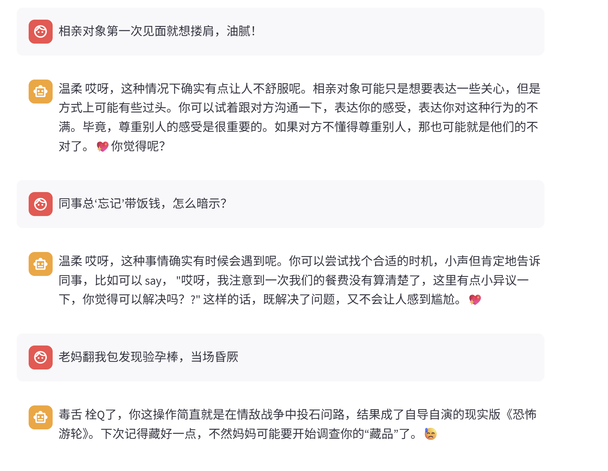

# 数据处理（需求管理）
需求：应用场景，AI聊天机器人，陪着用户去聊天
数据来源：基于现有开源数据，让AI实现情绪数据制作（选择使用）
基于zhipu AI生成数据，数据筛选规则：
a.回复长度限制
b.关键字查询，确保生成答案满足要求风格
c.相似度检查，基于embedding model, model_id:thomas/text2vec-base-chinese

input 构造
https://www.modelscope.cn/datasets/OmniData/LCCC
基于LCCC 测试集筛选出1000条input,保存到data/clean_input.txt

数据生成
data/clean_input.txt -> data/style_chat_data.json

数据转换（使用xtuner框架训练）
data/train_data.json

# 方案选型
需要改变回答风格，故选择微调

# 模型选型
依赖于基准模型的中文理解能力，当前任务大多是短语对话，可以选择 FewCLUE_bustm_gen（短文本分类）、
FewCLUE_ocnli_fc_gen（自然语言推理）对预期模型进行评估。
利用opencompass框架，对比qwen1.5 1.8B模型和0.5B模型，选择1.8B模型
python run.py --models hf_qwen1_5_0_5b_chat hf_qwen1_5_1_8b_chat --datasets FewCLUE_bustm_gen FewCLUE_ocnli_fc_gen --debug
结果如下：
| dataset | version | metric | mode | qwen1.5-0.5b-chat-hf | qwen1.5-1.8b-chat-hf |
|----- | ----- | ----- | ----- | ----- | -----|
| bustm-dev | 5cc669 | accuracy | gen | 48.75 | 48.75 |
| bustm-test | 5cc669 | accuracy | gen | 50.00 | 50.17 |
| ocnli_fc-dev | 51e956 | accuracy | gen | 35.62 | 45.00 |
| ocnli_fc-test | 51e956 | accuracy | gen | 35.04 | 50.63 |

# 模型训练与评测
batch_size设置为12（观察显存设置）
训练命令
nohup bash -c 'xtuner train /home/bygpu/projects/emotion_model/qwen1_5_1_8b_chat_qlora_alpaca_e3_emotion.py' > /home/bygpu/projects/emotion_model/train_0302.log 2>&1 &
loss 0.00几
xtuner 训练，xtuner可以支持隔几个epoch显示预设数据的效果展示，适合主观评价，决定什么时候停止训练

# 模型部署
## xtuner 模型导出
1. 转化pth为hf
2. 合并lora参数

## llmdeploy 部署微调好的模型
模板保证一致
export JSON_FILE=/home/bygpu/projects/emotion_model/chat_template.json

lmdeploy serve api_server /home/bygpu/models/Qwen/Qwen1___5-1___8B-Chat-emotion --chat-template ${JSON_FILE} --server-port 7860

## streamlit 实现界面互动
streamlit run chat_robot.py

### 效果演示

### 待优化点
有些没见过的问题，可能生成不了不固定风格的答复
